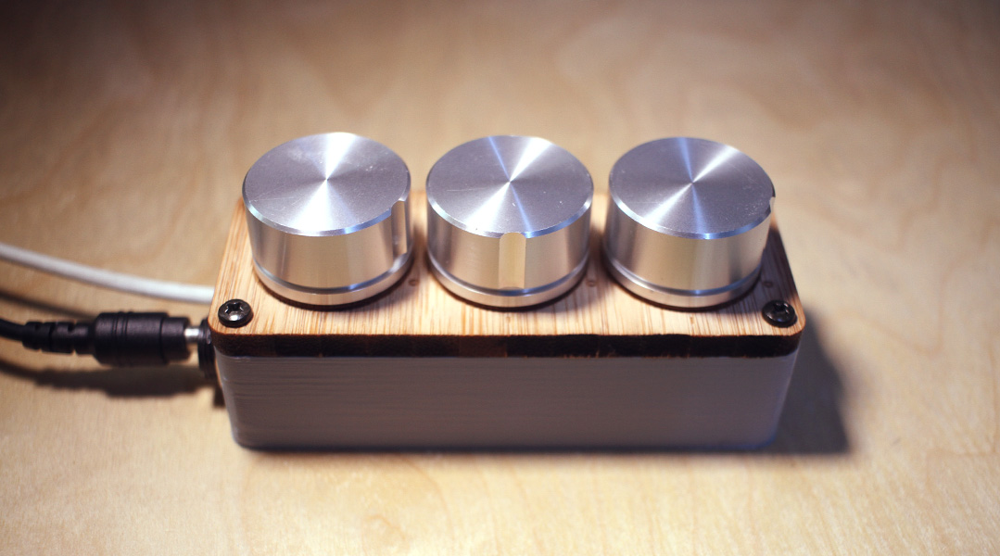
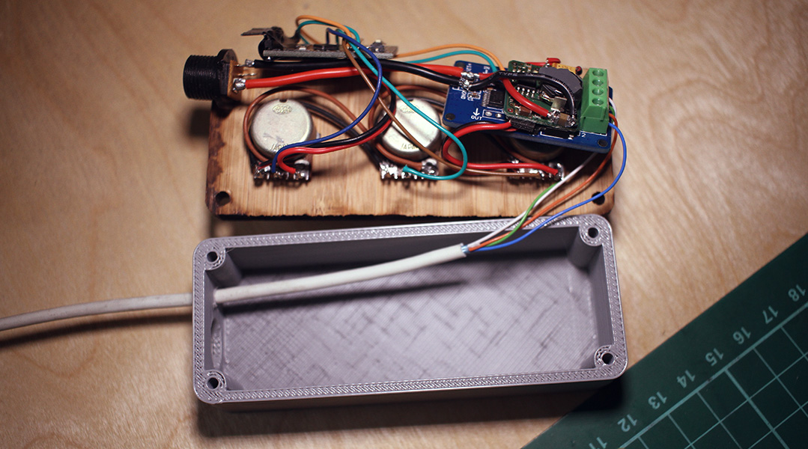
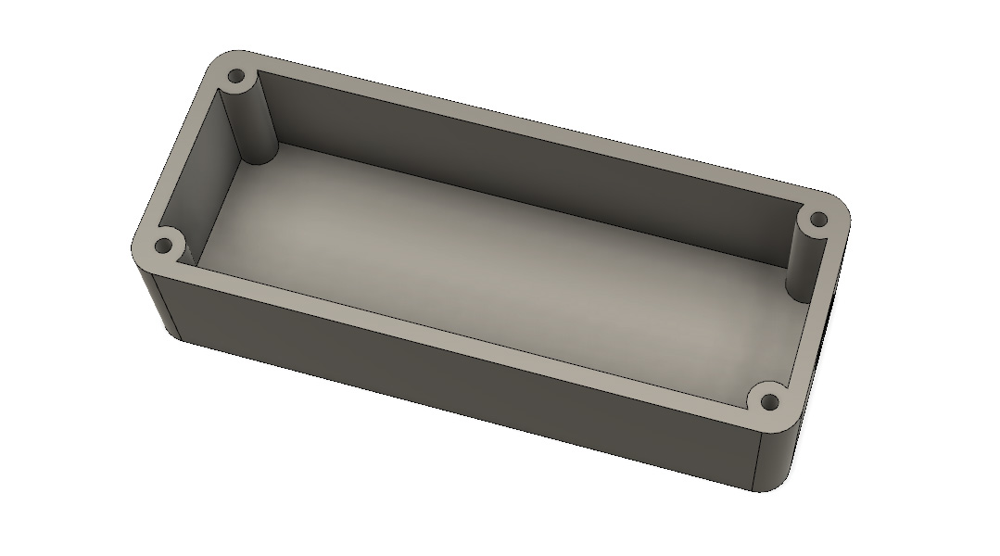

# HSV RGB LED strip controller

# Parts

* [P9813](https://www.aliexpress.com/item/Full-Color-RGB-LED-Strip-Driver-Module-Shield-for-Arduino-STM32-AVR-V1-0/32767844047.html) LED controller
* 1x Arduino nano
* 3x Analogue Pots
* 1x 5v or 3.3v (depending on your Arduino) Voltage regulator
* 1x 12v power input jack
* 1x 3D printed shell
* 1x Lazer cut faceplate

